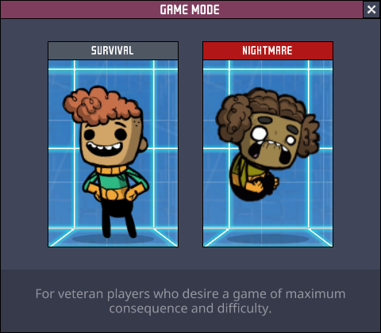

Nightmare Mode
===
A mod that adds a "Nightmare Mode" to [Oxygen Not Included][oni].

## Credits

Thanks to...

- The folks at [Klei Entertainment][k].
- [@pardeike][par] for [Harmony][h].
- [@peterhaneve][phe] for [PLib][p].
- [@Cairath][ca] for community modding work.
- [r/OxygenNotIncluded][roni] on Reddit.
- [@kludeman][kl] for gifting me a copy of ONI. Thanks buddy.

## License

- Original source code artifacts in the Nightmare Mode repository are published under [the MIT License](LICENSE.txt).

- The Harmony library is the property of Andreas Pardeike, available under [the MIT License][palic].

- The PLib library is the property of Peter Han, also available under [the MIT license][phmit].

- Oxygen Not Included and all Oxygen Not Included functionality, imagery, branding, or decompiled sources are the exclusive property of [Klei Entertainment][k].

[oni]: https://www.klei.com/games/oxygen-not-included
[h]: https://harmony.pardeike.net/articles/intro.html
[p]: https://github.com/peterhaneve/ONIMods/tree/main/PLib
[phe]: https://github.com/peterhaneve
[par]: https://github.com/pardeike
[roni]: https://www.reddit.com/r/Oxygennotincluded/
[k]: https://klei.com/
[ca]: https://github.com/Cairath
[ilm]: https://github.com/dotnet/ILMerge
[kl]: https://github.com/kludeman
[phmit]: https://github.com/peterhaneve/ONIMods/blob/main/LICENSE
[palic]: https://github.com/pardeike/Harmony/blob/master/LICENSE
